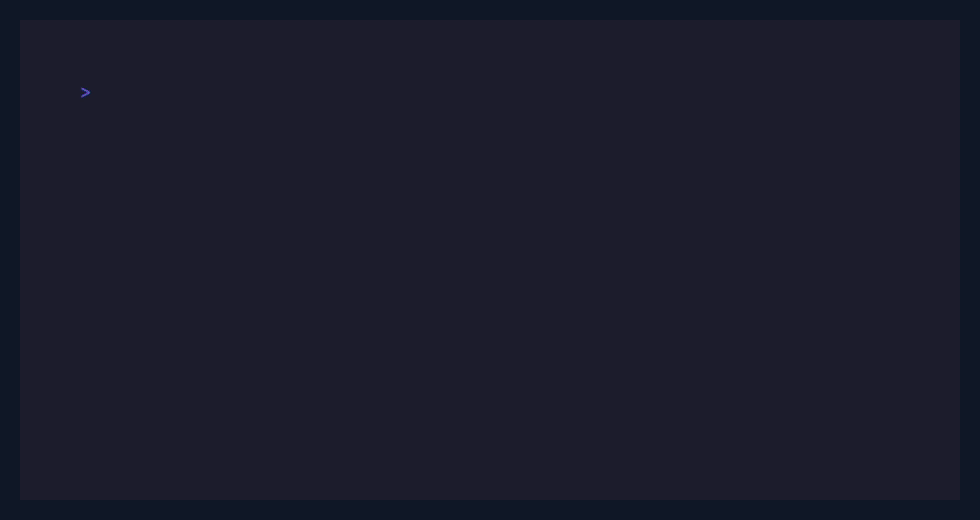

# termkit-go

[](https://pkg.go.dev/github.com/pol-cova/termkit-go)
[](https://github.com/pol-cova/termkit-go/actions/workflows/ci.yml)
[](LICENSE)

[](https://github.com/pol-cova/termkit-go/blob/main/docs/demo.gif)

The demo is a live Bubble Tea dashboard: use `1`–`5` to switch chart types,
`←`/`→` (or `h`/`l`) to move the selection, `tab` to switch series, and `q` to quit.

Run `go run ./cmd/demo --pixel` for raster charts. The demo auto-detects Kitty,
iTerm2, or ANSI half-block output.

Run `go run ./cmd/demo --dither-kit` for a static terminal comparison sheet
covering the avatar, button states, gradient wash, and decorative sparkline.

Terminal charts, motion, and UI components for Go CLIs and TUIs. The chart palette and texture are inspired by [Dither Kit](https://www.tripwire.sh/dither-kit).

## Install

```bash
go get github.com/pol-cova/termkit-go
```

## Packages

| Package | Includes | API |
| --- | --- | --- |
| `chart` | Area, line, bar, pie, radar; stacked and percent modes; interactive selection; pixel raster backend. | [docs](docs/charts.md) · [Go reference](https://pkg.go.dev/github.com/pol-cova/termkit-go/chart) |
| `pixel` | Logical-pixel canvas with ANSI, Kitty, iTerm2, and auto-detected protocol output. | [docs](docs/pixel-backend.md) · [Go reference](https://pkg.go.dev/github.com/pol-cova/termkit-go/pixel) |
| `style` | Shared Dither Kit palette, variants, bloom, and Bayer constants. | [Go reference](https://pkg.go.dev/github.com/pol-cova/termkit-go/style) |
| `animate` | Tween, spring, pulse, repeat, and easing helpers. | [docs](docs/components.md) · [Go reference](https://pkg.go.dev/github.com/pol-cova/termkit-go/animate) |
| `component` | Panels, inputs, selects, tabs, tables, sparklines, breadcrumbs, progress, gauges, spinners, badges, cards, dividers, status bars, dither-kit buttons, avatars, and gradient washes. | [docs](docs/components.md) · [Go reference](https://pkg.go.dev/github.com/pol-cova/termkit-go/component) |
| `bubbletea` | Thin helpers for chart scrubbing, inputs, and selects in Bubble Tea apps. | [cookbook](docs/bubbletea.md) · [Go reference](https://pkg.go.dev/github.com/pol-cova/termkit-go/bubbletea) |
| `sound` | Optional interaction cues through the terminal bell or your own player. | [Go reference](https://pkg.go.dev/github.com/pol-cova/termkit-go/sound) |

Each package returns values or strings. It does not own your event loop, terminal, or rendering framework.

## Quick start

```go
import (
    "fmt"

    "github.com/pol-cova/termkit-go/chart"
)

plot := chart.Chart{
    Kind: chart.Area,
    Labels: []string{"Jan", "Feb", "Mar", "Apr"},
    StackType: chart.Stacked,
    Series: []chart.Series{
        {Name: "desktop", Values: []float64{120, 190, 230, 210}, Variant: chart.Dotted},
        {Name: "mobile", Values: []float64{80, 120, 140, 110}, Variant: chart.Hatched},
    },
}

view, err := chart.Render(plot, chart.Options{Width: 56, Height: 12, Selected: 2, Color: true})
if err != nil { panic(err) }
fmt.Println(view)
```

### Bubble Tea

Keep selection in your model and render the view from `View`:

```go
view, err := chart.Render(plot, chart.Options{
    Width:        m.width,
    Height:       10,
    Selected:     m.selected,
    ActiveSeries: m.activeSeries,
    Color:        true,
})
if err != nil { return err.Error() }
return view
```

Update `m.selected` from arrow keys, `j`/`k`, or mouse input. See the [interactive demo](cmd/demo/main.go) for the complete model.

### Motion and status components

```go
import (
    "fmt"

    "github.com/pol-cova/termkit-go/animate"
    "github.com/pol-cova/termkit-go/component"
)

progress := animate.Tween(0.65, animate.EaseInOut)
fmt.Println(component.Progress("Deploy", progress, 20, component.Accent))
fmt.Println(component.SpinnerFrame(frame, "Connecting", component.Warning))
```

### Interactive building blocks

The component package stays event-loop neutral, but includes the primitives needed to build a small OpenTUI-style app:

```go
input := component.Input{Placeholder: "Search…", MaxLength: 80}
input.HandleKey("hello")
menu := component.Select{Options: []component.Option{{Label: "Dashboard"}, {Label: "Settings"}}, Height: 4}
menu.HandleKey("down")
fmt.Println(component.Panel("Command palette", input.View(true, component.Accent), 36, component.Accent))
fmt.Println(menu.View(32, component.Accent))
```

Sound is opt-in and has no platform dependency. `sound.Bell` emits the terminal's native cue; applications can implement `sound.Player` to synthesize or route cues elsewhere.

```go
import (
    "os"

    "github.com/pol-cova/termkit-go/sound"
)

player := sound.Bell{Out: os.Stdout}
player.Play(sound.Success)
```

## Demo

```bash
go run ./cmd/demo
```

Use `1`–`5` to change chart type, `←`/`→` (or `h`/`l`) to scrub, `tab` to switch series, and `q` to quit.

## Requirements

Go 1.24 or newer. The library itself has no required UI framework; the demo uses Bubble Tea.

## Docs

- [Charts and visual variants](docs/charts.md) — chart types, stacking, selection, and rendering options
- [Pixel raster backend](docs/pixel-backend.md) — logical-pixel charts with auto protocol detection
- [Bubble Tea cookbook](docs/bubbletea.md) — wiring charts, inputs, and motion into Bubble Tea
- [Motion and components](docs/components.md) — animation, panels, inputs, selects, tables, and interaction cues
- [Dither Kit fidelity map](docs/dither-kit-fidelity.md) — reference component mapping and ported visual constants
- [Interactive demo source](cmd/demo/main.go) · [VHS recording script](demo.tape) · [GIF preview](docs/demo.gif)
- [Go API: chart](https://pkg.go.dev/github.com/pol-cova/termkit-go/chart) · [component](https://pkg.go.dev/github.com/pol-cova/termkit-go/component) · [sound](https://pkg.go.dev/github.com/pol-cova/termkit-go/sound)
- [Contributing](CONTRIBUTING.md)

## Development

```bash
go test ./...
go vet ./...
vhs demo.tape
```

MIT licensed. See [LICENSE](LICENSE).
